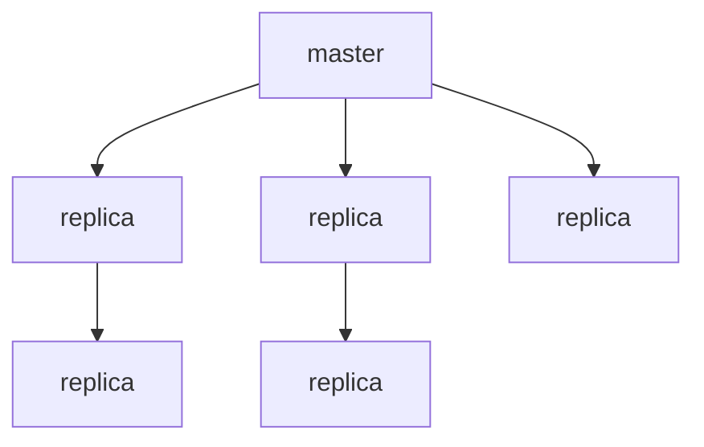
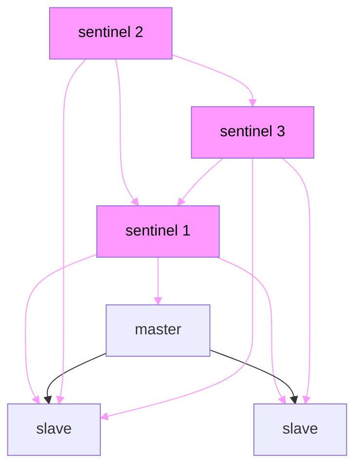
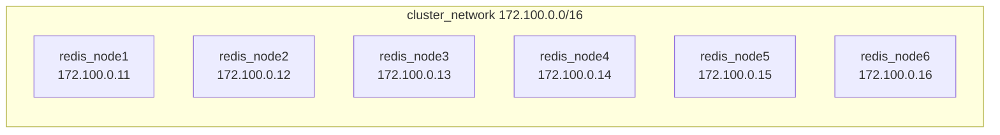

[title]: <> (Redis Cluster và Docker)

[description]: <> (Giới thiệu và một ví dụ nhỏ về Redis cluster hoạt động trong docker container)

[date]: <> (2023-04-12)

[tags]: <> (redis,docker)

> Docker sử dụng một kĩ thuật được gọi là `port mapping`: các chương trình chạy bên trong Docker containers có thể được 
> expose bằng một port khác so với port được init bởi chương trình dó. Điều này hữu dụng khi chạy nhiều containers cùng 
> một port, cùng lúc, cùng một server.
> Để docker có thể tương thích với Redis Cluster thì cần sử dụng `networking mode`.
> Follow https://redis.io/docs/management/scaling

## Redis Highly Available Architectures

### Redis Master-Slave Replication

Sau khi application side write data đến một `master` note, tất cả data được replicate đến `replica` node, và data có thể
được đồng bộ hóa với với nhiều node replica khác. Để tránh lỗi của từng node, cách thường làm là triển khai Redis trên 
nhiều server khác nhau và phân cụm chúng. Cách làm này dảm bảo độ tin cậy về dữ liệu và nếu một trong các redis server
không hoạt động thì dữ liệu trong redis vẫn có thể được truy xuất từ các node khác, tuy nhiên thì dễ thấy một vấn đề
nghiêm trọng là khi bất kì node master hoặc slave nào bị lỗi, cluster sẽ không thể read và write request, điều này cần 
được xử lý một cách thủ công để service có thể hoạt đông trở lại



### Redis Sentinel Mode

`Sentinel sentry` chạy như một process độc lập để thông báo các lệnh tới tất cả các node redis trong một cluster theo 1 
interval và chờ response, do dó cho phép nó có thể theo dõi các node redis trên, để đảm bảo tính khả dụng của service,
một số `sentiel` có thể cùng theo dõi các node trong một cluster. Khi một sentinel detect ra được rằng Master node không
khả dụng và sau đó các sentinel khác cũng detect ra điều tương tự và số lượng sentinel detect được đạt đế một giá trị 
nhất định các sentinel sẽ vote xem node nào sẽ lên làm master. Ở mode này thì việc switch node trong một cụm đảm bảo việc
không cần can thiệp một cách thử công khi node master không khả dụng. Tuy nhiên thì khi số lượng cluster đạt đến một mức 
độ nhất định thì việc bảo trì là một vấn đề lớn 



> I hack my brain with this above chart, I don't know the way to pretty this chart with mermaid

Tóm tắt lại cả 2 mô hình `master-slave` và `sentinel` đều chia tách việc read-write và đảm bảo service có tính sẵn sàng
tại một vài thời điểm.

## Redis Cluster

Những ưu điểm chính của Redis cluster như sau:

1. Pure native support, không cần bất kì hỗ trợ nào của bên thứ ba

2. Khả năng tự động phân vùng cho các node riêng lẻ, do đó không có sự tập trung dữ liệu trên một node

3. Một số node gặp sự cố sẽ không gây ảnh hưởng đến service và dữ liệu được khôi phục tự động

Một câu hỏi đặt ra là Redis làm điều đó như thế nào?

### Giao tiếp TCP giữa các node

Mỗi Redis node thường required 2 port TCP chạy đồng thời, một trong các port (default 6379) được dùng để tương tác với 
client, port khác được gọi là `bus port` (16379, thường là default port cộng với 10000), nó chịu trách nhiệm tương tác với các
node khác thông qua giao thức nhị phân. Giao tiếp giữa các node bao gồm detect trạng thái của mỗi node, cập nhật cấu hình
và transfer data. Do dó khi build một Redis Cluster, mỗi node redis phải mở 2 port TCP nếu không cluster sẽ không hoạt 
động bình thường.

### Data sharding

***khi write data tới Redis, làm thế nào Redis transfer data giữa các node trong cụm?***

Một Redis Cluster điển hình có 16384 `hash slots` và để tính toán `hash slot` cho key dã cho, redis đơn giản lấy 
[CRC16](https://en.wikipedia.org/wiki/Cyclic_redundancy_check) của key modulo 16386.
Ví dụ ở [Redis website](https://redis.io/docs/management/scaling/) như sau:

+ Node A chứa hash slots từ 0 - 5500

- Node B chứa hash slots từ 5501 - 11000

* Node C chưa hash slót từ 11001 - 16383

### Data backup giữa các nodes

Như model `master-slave` được mô tả bên trên thì Redis sử dụng mô hình này để đảm bảo `high availablity`, do đó ngoài 
master node thì slave node cũng cần được cấu hinh, và Redis sẽ sharding data và bất kì node nào có thể. Ví dụ, có 3 node 
A, B và C ta có thể config A1, B1, C1 làm 3 slave node. Nếu master node không khả dụng, redis sẽ sử dụng slave node do đó
data giữa master node và slave node là giống hệt.

### Tham số cấu hình

```yaml
cluster-enabled yes
cluster-config-file nodes.conf # nodes.conf is default file
cluster-node-timeout 5000
cluster-slave-validity-factor
cluster-migration-barrier
cluster-require-full-coverage
cluster-allow-reads-when-down
```

1. `cluster-enable` enable clustering or not
2. `cluster-config-file` file này không thể sửa đổi, mục đích để redis write node configuration
3. `cluster-node-timeout` Thời gian tối đa mà một node trong cụm không khả dụng

### Example



Dựng một redis cluster gồm 6 node trong đó có 3 master và 3 slave, để các node có thể giao tiếp được với nhau cần sử dụng
docker network là cầu nối. Một số file cần tạo như sau

1. File config cho từng node của redis để có thể join vào cluster

    Theo mặc định thì redis node sẽ đọc config ở file có tên là `redis.conf` làm mặc định, để khởi tạo container chứa 
    config này từ local cần tạo các file tương ứng để map vào volumes trong container tuy nhiên thì vì lười nên ở đây tác
    giả tạo 1 file config cho tất cả các node :v.
   
    Tạo 1 file có tên là `cluster_node.conf` ở thư mục hiện tại
    ```conf
    cluster-enabled yes
    cluster-config-file nodes.conf
    cluster-node-timeout 5000
    appendonly yes
    ```
2. Tạo file `vas.env` để load các biến môi trường cần thiết cho từ node

    ```env
    REDIS_VERSION = 7.2-rc1-alpine
    REDIS_PASSWORD = abcdefg@
    REDIS_PORT1 = 56531
    REDIS_PORT2 = 56532
    REDIS_PORT3 = 56533
    REDIS_PORT4 = 56534
    REDIS_PORT5 = 56535
    REDIS_PORT6 = 56536
    ```
   
3. Viết một `docker-compose.yml`

    ```yml
    version: "3.8"
    
    services:
      rc_node1:
        image: redis:${REDIS_VERSION}
        container_name: rc_node1
        hostname: rc_node1
        command: redis-server /usr/local/etc/redis/redis.conf
        volumes:
          - ./container-data/rc-node1:/data
          - ./cluster_node.conf:/usr/local/etc/redis/redis.conf
        ports:
          - ${REDIS_PORT1}:6379
        healthcheck:
          test: [ "CMD", "redis-cli","-p","6379","-a","${REDIS_PASSWORD}"]
          timeout: 10s
          interval: 3s
          retries: 10
        networks:
          cluster_network:
            ipv4_address: 172.100.0.11   
      rc_node2:
        image: redis:${REDIS_VERSION}
        container_name: rc_node2
        hostname: rc_node2
        command: redis-server /usr/local/etc/redis/redis.conf
        volumes:
          - ./container-data/rc-node2:/data
          - ./cluster_node.conf:/usr/local/etc/redis/redis.conf
        ports:
          - ${REDIS_PORT2}:6379
        healthcheck:
          test: [ "CMD", "redis-cli","-p","6379","-a","${REDIS_PASSWORD}"]
          timeout: 10s
          interval: 3s
          retries: 10
        networks:
          cluster_network:
            ipv4_address: 172.100.0.12
      rc_node3:
        image: redis:${REDIS_VERSION}
        container_name: rc_node3
        hostname: rc_node3
        command: redis-server /usr/local/etc/redis/redis.conf
        volumes:
          - ./container-data/rc-node3:/data
          - ./cluster_node.conf:/usr/local/etc/redis/redis.conf
        ports:
          - ${REDIS_PORT3}:6379
        healthcheck:
          test: [ "CMD", "redis-cli","-p","6379","-a","${REDIS_PASSWORD}"]
          timeout: 10s
          interval: 3s
          retries: 10
        networks:
          cluster_network:
            ipv4_address: 172.100.0.13
      rc_node4:
        image: redis:${REDIS_VERSION}
        container_name: rc_node4
        hostname: rc_node4
        command: redis-server /usr/local/etc/redis/redis.conf
        volumes:
          - ./container-data/rc-node4:/data
          - ./cluster_node.conf:/usr/local/etc/redis/redis.conf
        ports:
          - ${REDIS_PORT4}:6379
        healthcheck:
          test: [ "CMD", "redis-cli","-p","6379","-a","${REDIS_PASSWORD}"]
          timeout: 10s
          interval: 3s
          retries: 10
        networks:
          cluster_network:
            ipv4_address: 172.100.0.14
      rc_node5:
        image: redis:${REDIS_VERSION}
        container_name: rc_node5
        hostname: rc_node5
        command: redis-server /usr/local/etc/redis/redis.conf
        volumes:
          - ./container-data/rc-node5:/data
          - ./cluster_node.conf:/usr/local/etc/redis/redis.conf
        ports:
          - ${REDIS_PORT5}:6379
        healthcheck:
          test: [ "CMD", "redis-cli","-p","6379","-a","${REDIS_PASSWORD}"]
          timeout: 10s
          interval: 3s
          retries: 10
        networks:
          cluster_network:
            ipv4_address: 172.100.0.15
      rc_node6:
        image: redis:${REDIS_VERSION}
        container_name: rc_node6
        hostname: rc_node6
        command: redis-server /usr/local/etc/redis/redis.conf
        volumes:
          - ./container-data/rc-node6:/data
          - ./cluster_node.conf:/usr/local/etc/redis/redis.conf
        ports:
          - ${REDIS_PORT6}:6379
        healthcheck:
          test: [ "CMD", "redis-cli","-p","6379","-a","${REDIS_PASSWORD}"]
          timeout: 10s
          interval: 3s
          retries: 10
        networks:
          cluster_network:
            ipv4_address: 172.100.0.16
    
      cluster_helper:
        image: redis:${REDIS_VERSION}
        command: redis-cli --cluster create 172.100.0.11:6379 172.100.0.12:6379 172.100.0.13:6379 172.100.0.14:6379 172.100.0.15:6379 172.100.0.16:6379 --cluster-replicas 1 --cluster-yes
        depends_on:
          rc_node1:
            condition: service_healthy
          rc_node2:
            condition: service_healthy
          rc_node3:
            condition: service_healthy
          rc_node4:
            condition: service_healthy
          rc_node5:
            condition: service_healthy
          rc_node6:
            condition: service_healthy
        networks:
          - cluster_network
    networks:
      cluster_network:
        name: cluster_network
        driver: bridge
        ipam:
          driver: default
          config:
            - subnet: 172.100.0.0/24    
              gateway: 172.100.0.1
    ```
Trong file docker-compose trên thì `networks` sẽ làm cầu để các node có thể giao tiếp, khi chạy lệnh

```shell
docker network ls
```

sẽ thấy một network có tên `cluster_network`, các redis node được khởi tạo bên trên sẽ join vào network này.

```shell
docker network inspect cluster_network
```

Với file env và file config được tạo từ trước và cùng một thư mục, chạy lệnh sau để khởi tạo các container cho từng redis
node, trong đó container `cluster_hepler` sẽ giúp tạo một Redis Cluster thông qua ip của từng redis node

```shell
docker compose -p redis_cluster --env-file vars.env up -d --build --force-recreate
```

Và kế quả là:

```shell
[+] Running 7/7
 ⠿ Container rc_node1                        Healthy
 ⠿ Container rc_node6                        Healthy
 ⠿ Container rc_node2                        Healthy
 ⠿ Container rc_node3                        Healthy
 ⠿ Container rc_node5                        Healthy
 ⠿ Container rc_node4                        Healthy
 ⠿ Container redis_cluster-cluster_helper-1  Started
```

`docker ps`

```shell
CONTAINER ID   IMAGE                  COMMAND                  CREATED              STATUS                        PORTS                                                  NAMES
220a8b861895   redis:7.2-rc1-alpine   "docker-entrypoint.s…"   About a minute ago   Up About a minute (healthy)   0.0.0.0:56534->6379/tcp, :::56534->6379/tcp            rc_node4
b27644e30476   redis:7.2-rc1-alpine   "docker-entrypoint.s…"   About a minute ago   Up About a minute (healthy)   0.0.0.0:56535->6379/tcp, :::56535->6379/tcp            rc_node5
a54056fb498d   redis:7.2-rc1-alpine   "docker-entrypoint.s…"   About a minute ago   Up About a minute (healthy)   0.0.0.0:56533->6379/tcp, :::56533->6379/tcp            rc_node3
d45a7366c257   redis:7.2-rc1-alpine   "docker-entrypoint.s…"   About a minute ago   Up About a minute (healthy)   0.0.0.0:56536->6379/tcp, :::56536->6379/tcp            rc_node6
6bcd1b57ac70   redis:7.2-rc1-alpine   "docker-entrypoint.s…"   About a minute ago   Up About a minute (healthy)   0.0.0.0:56531->6379/tcp, :::56531->6379/tcp            rc_node1
1715f9ad6460   redis:7.2-rc1-alpine   "docker-entrypoint.s…"   About a minute ago   Up About a minute (healthy)   0.0.0.0:56532->6379/tcp, :::56532->6379/tcp            rc_node2
```

Execute một node bất kì:

```shell
docker exec -it rc_node1 sh
```

Xem các node trong cluster

```shell
redis-cli cluster nodes

a8d36895f669460b4db4a787e1a9955b3e40fe1d 172.100.0.15:6379@16379,,shard-id=d96bd4e1440127303c398b3913952f9e86be1690 slave 149ed140c6b0f982ac40f01963920d55de554394 0 1681472434286 1 connected
149ed140c6b0f982ac40f01963920d55de554394 172.100.0.11:6379@16379,,shard-id=d96bd4e1440127303c398b3913952f9e86be1690 myself,master - 0 1681472432000 1 connected 0-5460
0e289422a99cf727e24e614dcff81e172452b2e4 172.100.0.13:6379@16379,,shard-id=9277e1bffd91bde4d2b78063d49b8ae8c8ad2843 master - 0 1681472433582 3 connected 10923-16383
48394b93342b1ae0f570ac965f846f7f30b96fc7 172.100.0.16:6379@16379,,shard-id=32f98cc6c890d051aea848220c34356abe37f94d slave 260bf8c09213bcd32a45d58a6b4733031f4678ae 0 1681472433000 2 connected
bd563011a660a3e9e6e891e0f4446f89f4b3033c 172.100.0.14:6379@16379,,shard-id=9277e1bffd91bde4d2b78063d49b8ae8c8ad2843 slave 0e289422a99cf727e24e614dcff81e172452b2e4 0 1681472433298 3 connected
260bf8c09213bcd32a45d58a6b4733031f4678ae 172.100.0.12:6379@16379,,shard-id=32f98cc6c890d051aea848220c34356abe37f94d master - 0 1681472433783 2 connected 5461-10922
```

Thêm một vài dữ liệu:

```shell
redis-cli -c -p 6379

127.0.0.1:6379> set hihi haha
-> Redirected to slot [9959] located at 172.100.0.12:6379
OK
```

Sang `rc_node2` query data:

```shell
docker exec -it rc_node2 sh

redis-cli -c -p 6379

127.0.0.1:6379> get hihi
"haha"
127.0.0.1:6379>
```

Done setup :)))

### Go code to connect redis cluster

```go
const letterBytes = "abcdefghijklmnopqrstuvwxyzABCDEFGHIJKLMNOPQRSTUVWXYZ"

func randStringBytes(n int) string {
	b := make([]byte, n)
	for i := range b {
		b[i] = letterBytes[rand.Intn(len(letterBytes))]
	}
	return string(b)
}

func main() {
	rc := newRedisClient("172.100.0.11:6379,172.100.0.12:6379,172.100.0.13:6379,172.100.0.14:6379,172.100.0.15:6379,172.100.0.16:6379")
	for i := 0; i < 5; i++ {
		key := randStringBytes(5)
		value := randStringBytes(5)
		fmt.Printf("value: %s\n", key)
		err := rc.setKey(key, value, time.Minute*1)
		if err != nil {
			log.Fatalf("Error: %v", err.Error())
		}
		value, err = rc.getKey(key)
		if err != nil {
			log.Fatalf("Error: %v", err.Error())
		}
		fmt.Printf("get value: %s\n", key)
	}
}

type redisClient struct {
	c *redis.ClusterClient
}

func newRedisClient(hostnames string) *redisClient {
	addr := strings.Split(hostnames, ",")
	c := redis.NewClusterClient(&redis.ClusterOptions{
		Addrs: addr,
	})
	if err := c.Ping().Err(); err != nil {
		panic("Unable to connect to redis " + err.Error())
	}
	return &redisClient{
		c: c,
	}
}

func (client *redisClient) getKey(key string) (string, error) {
	val, err := client.c.Get(key).Result()
	if err == redis.Nil || err != nil {
		return "", err
	}
	return val, nil
}

func (client *redisClient) setKey(key string, value interface{}, expiration time.Duration) error {
	cacheEntry, err := json.Marshal(value)
	if err != nil {
		return err
	}
	err = client.c.Set(key, cacheEntry, expiration).Err()
	if err != nil {
		return err
	}
	return nil
}
```

Run đoạn chương trình lên và được kết quả là:

```shell

value: VlBzg
get value: VlBzg
value: whTHc
get value: whTHc
value: FDaFp
get value: FDaFp
value: EFfRs
get value: EFfRs
value: bCsNV
get value: bCsNV
```

## Cái này có giúp bạn tăng lương không?

[May be](https://news.ycombinator.com/item?id=3067434)

Nhưng chúc mừng bạn đã đọc đến đây, trên chỉ là demo local cho redis cluster, việc setup để có thể dùng thực tế còn nhiều cái
phải thực hiện, tuy nhiên thì đâu đấy cũng đã tìm được một chút hứng thú để nghiên cứu cái này.

Happy coding <3