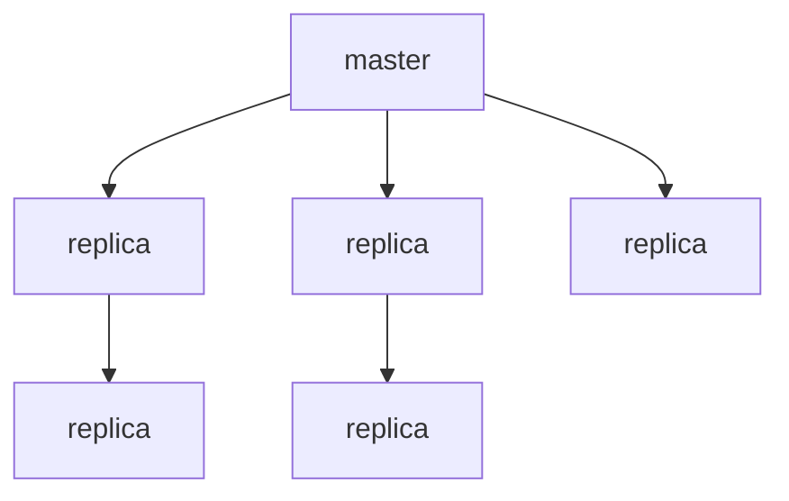
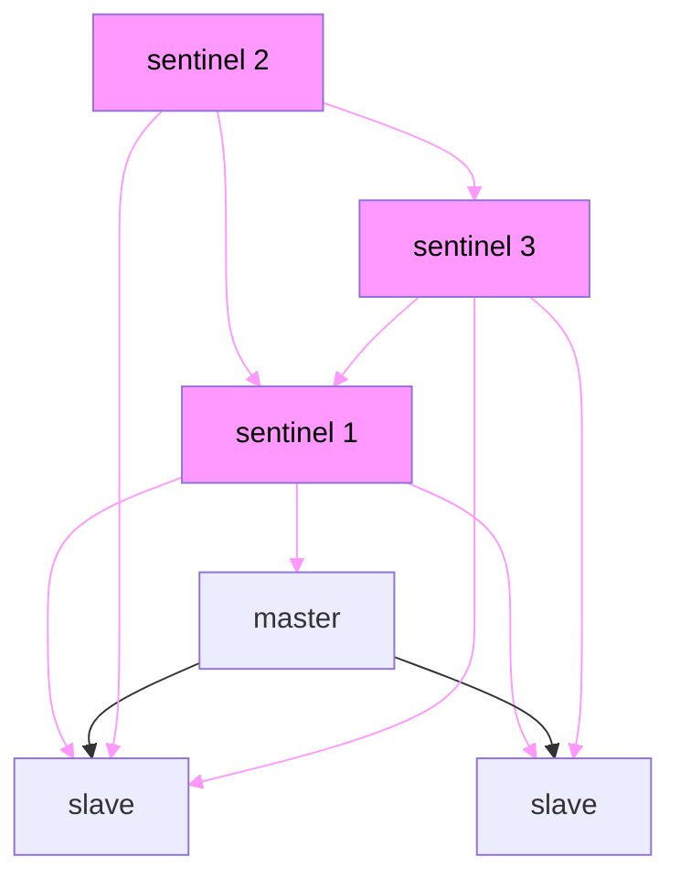

[title]: <> (Redis Cluster và Docker)

[description]: <> (Giới thiệu và một ví dụ nhỏ về Redis cluster hoạt động trong docker container)

[date]: <> (2023-04-12)

[tags]: <> (redis,docker)

> Docker sử dụng một kĩ thuật được gọi là `port mapping`: các chương trình chạy bên trong Docker containers có thể được 
> expose bằng một port khác so với port được init bởi chương trình dó. Điều này hữu dụng khi chạy nhiều containers cùng 
> một port, cùng lúc, cùng một server.
> Để docker có thể tương thích với Redis Cluster thì cần sử dụng `networking mode`.
> Follow https://redis.io/docs/management/scaling

## Redis Highly Available Architectures

### Redis Master-Slave Replication

Sau khi application side write data đến một `master` note, tất cả data được replicate đến `replica` node, và data có thể
được đồng bộ hóa với với nhiều node replica khác. Để tránh lỗi của từng node, cách thường làm là triển khai Redis trên 
nhiều server khác nhau và phân cụm chúng. Cách làm này dảm bảo độ tin cậy về dữ liệu và nếu một trong các redis server
không hoạt động thì dữ liệu trong redis vẫn có thể được truy xuất từ các node khác, tuy nhiên thì dễ thấy một vấn đề
nghiêm trọng là khi bất kì node master hoặc slave nào bị lỗi, cluster sẽ không thể read và write request, điều này cần 
được xử lý một cách thủ công để service có thể hoạt đông trở lại



### Redis Sentinel Mode

`Sentinel sentry` chạy như một process độc lập để thông báo các lệnh tới tất cả các node redis trong một cluster theo 1 
interval và chờ response, do dó cho phép nó có thể theo dõi các node redis trên, để đảm bảo tính khả dụng của service,
một số `sentiel` có thể cùng theo dõi các node trong một cluster. Khi một sentinel detect ra được rằng Master node không
khả dụng và sau đó các sentinel khác cũng detect ra điều tương tự và số lượng sentinel detect được đạt đế một giá trị 
nhất định các sentinel sẽ vote xem node nào sẽ lên làm master. Ở mode này thì việc switch node trong một cụm đảm bảo việc
không cần can thiệp một cách thử công khi node master không khả dụng. Tuy nhiên thì khi số lượng cluster đạt đến một mức 
độ nhất định thì việc bảo trì là một vấn đề lớn 



> I hack my brain with this above chart, I don't know the way to pretty this chart with mermaid

Tóm tắt lại cả 2 mô hình `master-slave` và `sentinel` đều chia tách việc read-write và đảm bảo service có tính sẵn sàng
tại một vài thời điểm.

## Redis Cluster

Những ưu điểm chính của Redis cluster như sau:

1. Pure native support, không cần bất kì hỗ trợ nào của bên thứ ba

2. Khả năng tự động phân vùng cho các node riêng lẻ, do đó không có sự tập trung dữ liệu trên một node

3. Một số node gặp sự cố sẽ không gây ảnh hưởng đến service và dữ liệu được khôi phục tự động

Một câu hỏi đặt ra là Redis làm điều đó như thế nào?

### Giao tiếp TCP giữa các node

Mỗi Redis node thường required 2 port TCP chạy đồng thời, một trong các port (default 6379) được dùng để tương tác với 
client, port khác được gọi là `bus port` (16379, thường là default port cộng với 10000), nó chịu trách nhiệm tương tác với các
node khác thông qua giao thức nhị phân. Giao tiếp giữa các node bao gồm detect trạng thái của mỗi node, cập nhật cấu hình
và transfer data. Do dó khi build một Redis Cluster, mỗi node redis phải mở 2 port TCP nếu không cluster sẽ không hoạt 
động bình thường.

### Data sharding

***khi write data tới Redis, làm thế nào Redis transfer data giữa các node trong cụm?***

Một Redis Cluster điển hình có 16384 `hash slots` và để tính toán `hash slot` cho key dã cho, redis đơn giản lấy 
[CRC16](https://en.wikipedia.org/wiki/Cyclic_redundancy_check) của key modulo 16386.
Ví dụ ở [Redis website](https://redis.io/docs/management/scaling/) như sau:

+ Node A chứa hash slots từ 0 - 5500

- Node B chứa hash slots từ 5501 - 11000

* Node C chưa hash slót từ 11001 - 16383

### Data backup giữa các nodes

Như model `master-slave` được mô tả bên trên thì Redis sử dụng mô hình này để đảm bảo `high availablity`, do đó ngoài 
master node thì slave node cũng cần được cấu hinh, và Redis sẽ sharding data và bất kì node nào có thể. Ví dụ, có 3 node 
A, B và C ta có thể config A1, B1, C1 làm 3 slave node. Nếu master node không khả dụng, redis sẽ sử dụng slave node do đó
data giữa master node và slave node là giống hệt.

### Tham số cấu hình

```yaml
cluster-enabled yes
cluster-config-file
cluster-node-timeout
cluster-slave-validity-factor
cluster-migration-barrier
cluster-require-full-coverage
cluster-allow-reads-when-down
```

1. `cluster-enable` enable clustering or not
2. `cluster-config-file` file này không thể sửa đổi, mục đích để redis write node configuration
3. `cluster-node-timeout` Thời gian tối đa mà một node trong cụm không khả dụng

> To be continue

